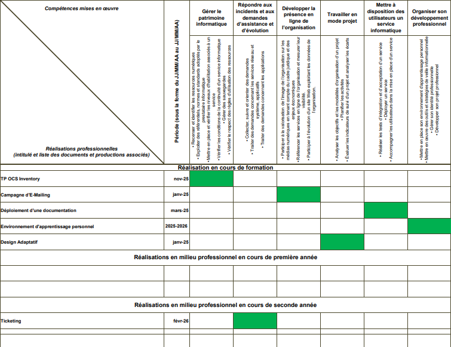

# CV

Vous pouvez consulter mon CV ici :  
[Télécharger le CV](assets/cv-arthur.pdf)

---

# Compétences acquises (grille E5)

Tableau de synthèse E5 :

# Réalisations associées

- OCS Inventory : [voir le projet](competences/patrimoine-informatique.md)
- Campagne d’e-mailing : [voir le projet](competences/presence-en-ligne.md)
- Design adaptatif : [voir le projet](competences/travail-mode-projet.md)
- Déploiement documentation : [voir le projet](competences/deploiement-service-info.md)
- Outil de ticketing : [voir le projet](competences/support-assistance.md)
- Développement professionnel : [voir le projet](competences/developpement-professionnel.md)

---

# Référence officielle

Tableau de synthèse E5 :  
[Accéder au fichier](assets/e5-tableau-synthese.xlsx)
